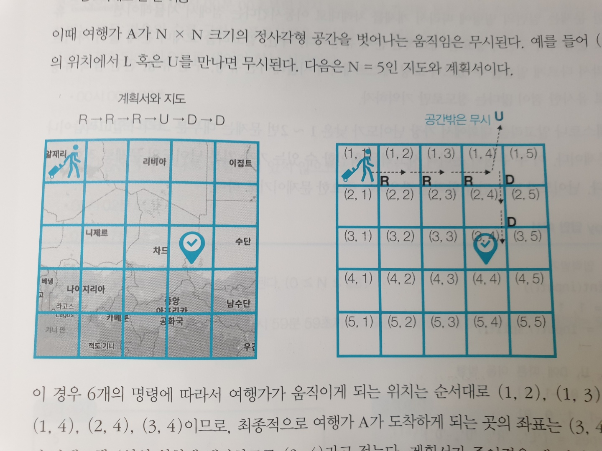

# CHAPTER 4 구현
## 상하좌우

> 시간 제한 1초 | 메모리 제한 128MB

여행가 A는 N x N 크기의 정사각형 공간 위에 서 있다. 이 공간은 1 x 1 크기의 정사각형으로 나누어져있다.
가장 왼쪽 위 좌표는 (1,1)이며, 가장 오른쪽 아래 좌표는 (N,N)에 해당한다. 여행가 A는 상,하,좌,우 방향으로
이동할 수 있으며, 시작 좌표는 항상 (1,1)이다. 우리 앞에는 여행가 A가 이동할 계획이 적힌 계획서가 놓여있다. 
계획서에는 하나의 줄에 띄어쓰기를 기준으로 하여 L, R, U, D 중 하나의 문자가 반복적으로 적혀있다. 
각 문자의 의미는 다음과 같다. <br>
```
L : 왼쪽으로 한 칸 이동
R : 오른쪽으로 한 칸 이동
U : 위로 한 칸 이동
D : 아래로 한 칸 이동
```

이때 여행가 A가 N x N 크기의 정사각형 공간을 벗어나는 움직임은 무시된다. 예를 들어 (1,1)의 위치에서
L 혹은 U를 만나면 무시된다. 다음은 N = 5인 지도와 계획서이다. <br>
(그림)


이 경우 6개의 명령에 따라서 여행가가 움직이게 되는 위치는 순서대로 (1,2), (1,3), (1,4), (1,4) 
 (2,4), (3,4)이므로, 최종적으로 여행가 A가 도착하게 되는 곳의 좌표는 (3,4)라고 적는다. 계획서가 주어졌을 때
 여행가 A가 최종적으로 도착할 지점의 좌표를 출력하는 프로그램을 작성하라  <br>
 
### 입력조건 
> 첫째 줄에 공간의 크기를 나타내는 N이 주어진다. (1 <= N <= 100)
>둘째 줄에 여행가 A가 이동할 계획서 내용이 주어진다. (1 <= 이동횟수 < 100)

### 출력조건
> 첫째 줄에 여행가 A가 최종적으로 도착할 지점의 좌표 (X,Y)를 공백으로 구분하여 출력한다.

### 입력예시
```
5
R R R U D D
```

### 출력예시
```
3 4
```

### 나의 풀이 
```java
import java.util.Scanner;

public class Problem1 { // 나의 풀이는 too long 함.. 또 길어지니까 한눈에 안보임! 
    private static final String MOVE_RIGHT = "R";
    private static final String MOVE_LEFT = "L";
    private static final String MOVE_UP = "U";
    private static final String MOVE_DOWN = "D";
    private static final int[] START_POINT = {1, 1};
    private static final int COLUMN = 1;
    private static final int ROW = 0;

    private static int n;

    public static void main(String[] args) {
        Scanner sc = new Scanner(System.in);
        n = Integer.parseInt(sc.nextLine());
        String[] plans = sc.nextLine().split(" ");

        int[] currentPoint = START_POINT;

        for (String plan : plans) {
            move(currentPoint, plan);
        }

        System.out.println(currentPoint[0] + " " + currentPoint[1]);
    }

    private static void move(int[] currentPoint, String plan) {
        if (plan.equals(MOVE_RIGHT)) {
            if (currentPoint[COLUMN] + 1 <= n) {
                currentPoint[COLUMN]++;
                return;
            }

            return;
        }

        if (plan.equals(MOVE_LEFT)) {
            if (currentPoint[COLUMN] - 1 > 0) {
                currentPoint[COLUMN]--;
                return;
            }

            return;
        }

        if (plan.equals(MOVE_UP)) {
            if (currentPoint[ROW] - 1 > 0) {
                currentPoint[ROW]--;
                return;
            }

            return;
        }

        if (plan.equals(MOVE_DOWN)) {
            if (currentPoint[ROW] + 1 <= n) {
                currentPoint[ROW]++;
                return;
            }
            return;
        }
    }
}

```

### 정답 
```java
import java.util.*;

public class Main {

    public static void main(String[] args) {
        Scanner sc = new Scanner(System.in);

        // N을 입력받기
        int n = sc.nextInt();
        sc.nextLine(); // 버퍼 비우기
        String[] plans = sc.nextLine().split(" ");
        int x = 1, y = 1;

        // L, R, U, D에 따른 이동 방향 
        int[] dx = {0, 0, -1, 1};
        int[] dy = {-1, 1, 0, 0};
        char[] moveTypes = {'L', 'R', 'U', 'D'}; // 이런 전략을 잘 가져오기! 

        // 이동 계획을 하나씩 확인
        for (int i = 0; i < plans.length; i++) {
            char plan = plans[i].charAt(0);
            // 이동 후 좌표 구하기 
            int nx = -1, ny = -1;
            for (int j = 0; j < 4; j++) {
                if (plan != moveTypes[j]) continue;

                nx = x + dx[j];
                ny = y + dy[j];
                break; //별로 영향은 없지만 이렇게 변경해봄
            }
            // 공간을 벗어나는 경우 무시 
            if (nx < 1 || ny < 1 || nx > n || ny > n) continue;
            // 이동 수행 
            x = nx;
            y = ny;
        }

        System.out.println(x + " " + y);
    }
}
```
